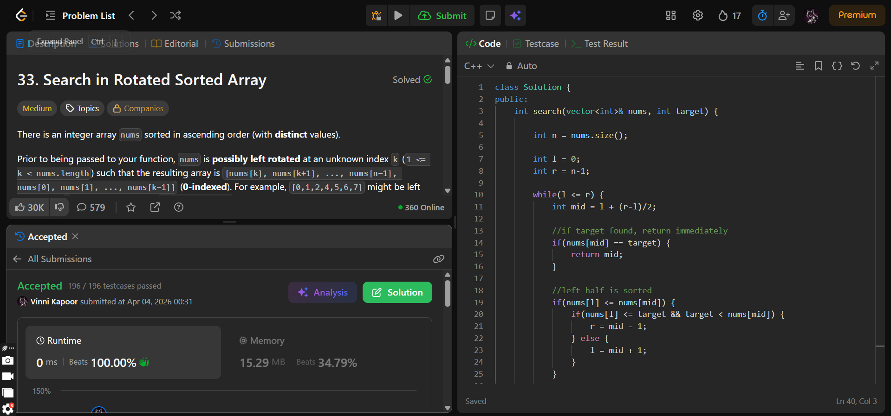

## Problem

**Search in Rotated Sorted Array (LeetCode 33)**

Given a rotated sorted array `nums` (with distinct values) and a target value, return its index if found, otherwise return `-1`.

You must achieve **O(log n)** time complexity.

---

## Approach

Use **modified binary search**.

### Logic:

* Perform standard binary search with additional checks
* At each step:
  - Identify which half is sorted
  - Check if target lies within that sorted half
  - Narrow search accordingly

### Key Idea:

* Either left half or right half will always be sorted
* Use this property to decide direction

---

## Complexity

* **Time Complexity:** O(log n)  
* **Space Complexity:** O(1)  

---

## Solution

```cpp
class Solution {
public:
    int search(vector<int>& nums, int target) {
        
        int n = nums.size();

        int l = 0;
        int r = n-1;

        while(l <= r) {
            int mid = l + (r-l)/2;

            //if target found, return immediately
            if(nums[mid] == target) {
                return mid;
            } 

            //left half is sorted
            if(nums[l] <= nums[mid]) {
                if(nums[l] <= target && target < nums[mid]) {
                    r = mid - 1;
                } else {
                    l = mid + 1;
                }
            }

            //right half is sorted
            else {
                if(nums[mid] < target && target <= nums[r]) {
                    l = mid + 1;
                } else {
                    r = mid - 1;
                }
            }
        }

        //if target not found
        return -1;
    }
};
```

---

## Proof of Submission



---