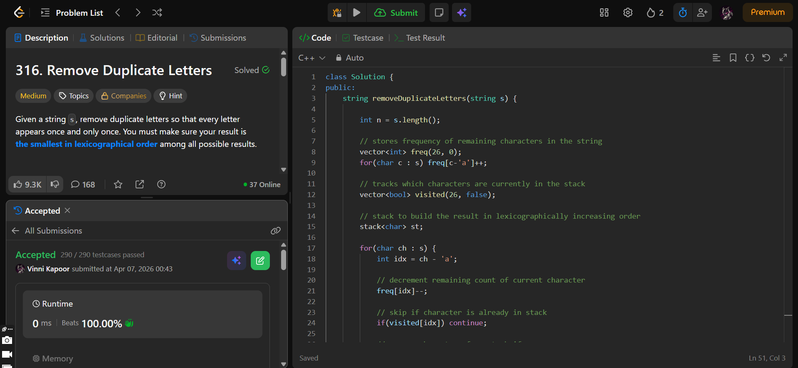

## Problem  

**Remove Duplicate Letters (LeetCode 316)**  

Given a string `s`, remove duplicate letters so that:

- Every letter appears **once and only once**  
- The result is the **smallest in lexicographical order** among all possible results  

---

## Approach  

Use a **monotonic stack + greedy strategy** to construct the smallest lexicographical string.

### Logic:

- Maintain:
  - `freq[]` → frequency of remaining characters  
  - `visited[]` → whether a character is already in stack  
  - Stack → stores result characters  

- Traverse string:
  - Decrease frequency of current character  
  - If already visited → skip  

  - While:
    - Stack not empty  
    - Top character > current character (lexicographically larger)  
    - Top character appears later again (`freq > 0`)  
    → Pop from stack and mark as not visited  

  - Push current character into stack and mark visited  

- Build result:
  - Pop all elements from stack  
  - Reverse to get correct order  

---

## Complexity  

- **Time Complexity:** O(n)  
  - Each character pushed and popped at most once  

- **Space Complexity:** O(1)  
  - Fixed size arrays (26 letters) + stack  

---

## Solution  

```cpp
class Solution {
public:
    string removeDuplicateLetters(string s) {

        int n = s.length();

        // stores frequency of remaining characters in the string
        vector<int> freq(26, 0);
        for(char c : s) freq[c-'a']++;

        // tracks which characters are currently in the stack
        vector<bool> visited(26, false);

        // stack to build the result in lexicographically increasing order
        stack<char> st;

        for(char ch : s) {
            int idx = ch - 'a';

            // decrement remaining count of current character
            freq[idx]--;

            // skip if character is already in stack
            if(visited[idx]) continue;

            // remove characters from stack if:
            // they are greater than current character (to get smaller lex order)
            // they will appear later again (safe to remove)
            while(!st.empty() && st.top() > ch && freq[st.top() - 'a'] > 0) {
                visited[st.top() - 'a'] = false;
                st.pop();
            }

            // push current character into stack and mark it visited
            st.push(ch);
            visited[idx] = true;
        }

        // pop all characters from stack to form the result string
        string res;
        while(!st.empty()) {
            res.push_back(st.top());
            st.pop();
        }

        // reverse because stack stores characters in reverse order
        reverse(res.begin(), res.end());

        return res;  // lexicographically smallest unique string
    }
};
```

---

## Proof of Submission



---