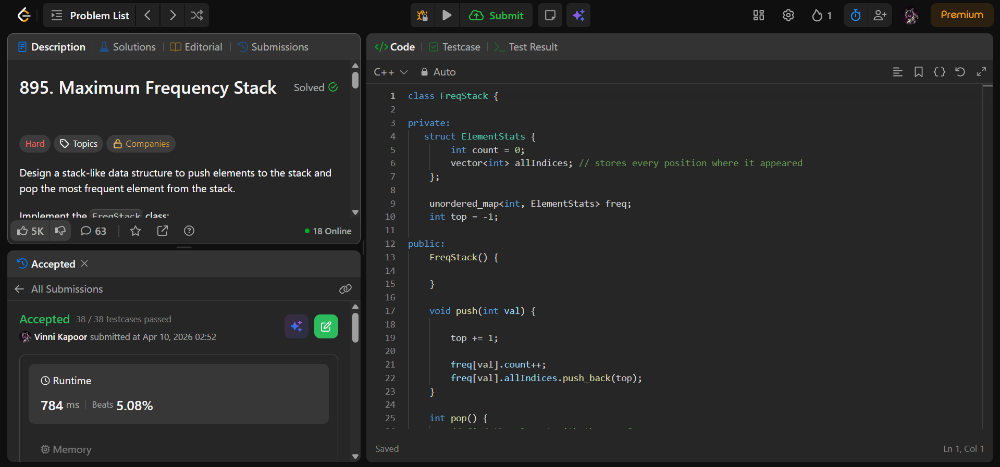

## Problem  

**Maximum Frequency Stack (LeetCode 895)**  

Design a stack-like data structure that supports:

- `push(val)` → push element onto stack  
- `pop()` → remove and return the **most frequent element**  

### Rules:
- Element with highest frequency is removed first  
- If tie → return element **closest to top** (most recent)  

---

## Approach  

Use a **hash map + custom selection (greedy scan)** to track frequency and recency.

### Logic:

- Maintain:
  - `freq[val].count` → frequency of element  
  - `freq[val].allIndices` → all positions (to track recency)  
  - `top` → global index to simulate stack order  

- **push(val):**
  - Increment global index  
  - Increase frequency  
  - Store index in `allIndices`  

- **pop():**
  - Use `max_element` over map:
    - First compare frequency  
    - If tie → compare latest index (`allIndices.back()`)  
  - Remove last occurrence of chosen element  
  - Decrease frequency  
  - Remove from map if frequency becomes zero  

---

## Complexity  

- **Time Complexity:**  
  - `push`: O(1)  
  - `pop`: O(n) → scan entire map  

- **Space Complexity:** O(n)  

---

## Solution  

```cpp
class FreqStack {

private:
   struct ElementStats {
        int count = 0;
        vector<int> allIndices; // stores every position where it appeared
    };

    unordered_map<int, ElementStats> freq;
    int top = -1;

public:
    FreqStack() {
        
    }
    
    void push(int val) {

        top += 1;
        
        freq[val].count++;
        freq[val].allIndices.push_back(top);
    }
    
    int pop() {
        // find the element with the max frequency. 
        // If frequencies tie, pick the one with the highest index (closest to top).
        
        auto it = std::max_element(
            freq.begin(), 
            freq.end(),
            
            [](const auto& a, const auto& b) {
                
                // rule 1: Higher frequency wins
                if (a.second.count != b.second.count) {
                    return a.second.count < b.second.count;
                }

                // rule 2: If tied, the one with the index closest to top wins
                return a.second.allIndices.back() < b.second.allIndices.back();
            }
        );
    
        // grab the value to return it later
        int val = it->first;

        // clean up the stats for this element
        it->second.allIndices.pop_back(); // remove the index we just popped
        it->second.count--;               // decrease its frequency

        // if the element has no more occurrences, remove it from the map
        if (it->second.count == 0) {
            freq.erase(it);
        }
       
        return val;
    }
};
```

---

## Proof of Submission



---