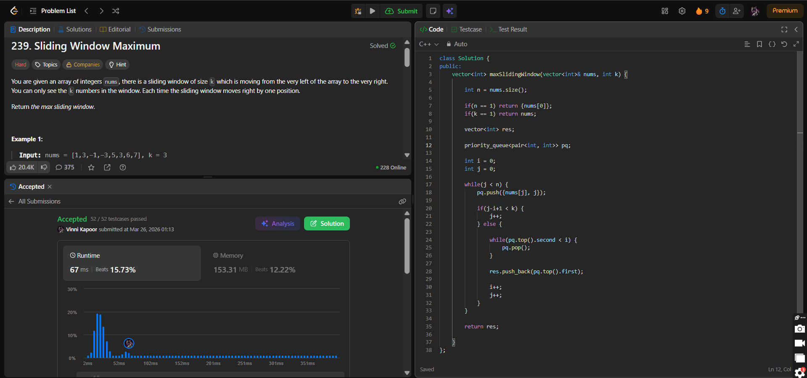

## Problem

**Sliding Window Maximum (LeetCode 239)**

You are given an array of integers `nums` and an integer `k`, representing the size of a sliding window.

The window moves from left to right, one position at a time.  
Return the maximum value in each window.

---

## Approach

Use a **Max Heap (Priority Queue)** to track the maximum element in the current window.

### Logic:

* Maintain a max heap storing `{value, index}`
* Traverse the array using a sliding window:
  - Push current element into heap
  - When window size reaches `k`:
    - Remove elements outside the window (`index < i`)
    - Top of heap gives maximum
    - Add it to result
    - Slide window forward

---

## Complexity

* **Time Complexity:** O(n log n)  
* **Space Complexity:** O(n)  

---

## Solution

```cpp
class Solution {
public:
    vector<int> maxSlidingWindow(vector<int>& nums, int k) {

        int n = nums.size();

        if(n == 1) return {nums[0]};
        if(k == 1) return nums;

        vector<int> res;

        priority_queue<pair<int, int>> pq;

        int i = 0;
        int j = 0;

        while(j < n) {
            pq.push({nums[j], j});

            if(j - i + 1 < k) {
                j++;
            } else {

                while(pq.top().second < i) {
                    pq.pop();
                }

                res.push_back(pq.top().first);

                i++;
                j++;
            }
        }

        return res;
    }
};
```

---

## Proof of Submission



---