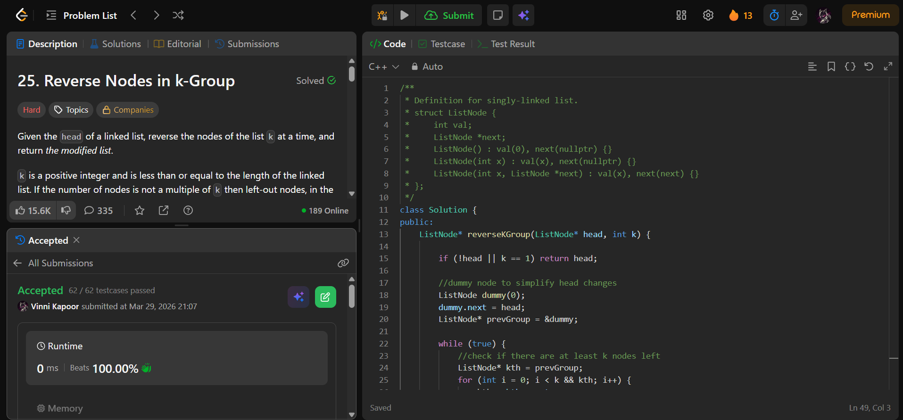

## Problem

**Reverse Nodes in k-Group (LeetCode 25)**

Given the head of a linked list, reverse the nodes of the list `k` at a time and return the modified list.

- If the number of nodes is not a multiple of `k`, the remaining nodes should remain as they are.
- You may not change node values, only node pointers.

---

## Approach

Use **iterative reversal with a dummy node** to handle edge cases cleanly.

### Logic:

* Create a dummy node pointing to head
* Maintain pointer `prevGroup` → node before current group

### Steps:

1. Check if at least `k` nodes exist ahead  
2. Reverse `k` nodes using pointer manipulation  
3. Connect reversed group back to list  
4. Move `prevGroup` to end of reversed group  
5. Repeat  

---

## Complexity

* **Time Complexity:** O(n)  
* **Space Complexity:** O(1)  

---

## Solution

```cpp
class Solution {
public:
    ListNode* reverseKGroup(ListNode* head, int k) {
        
        if (!head || k == 1) return head;

        ListNode dummy(0);
        dummy.next = head;
        ListNode* prevGroup = &dummy;

        while (true) {
            // check if k nodes exist
            ListNode* kth = prevGroup;
            for (int i = 0; i < k && kth; i++) {
                kth = kth->next;
            }
            if (!kth) break;

            // reverse k nodes
            ListNode* groupPrev = prevGroup->next;
            ListNode* curr = groupPrev->next;
            ListNode* nextNode;

            for (int i = 1; i < k; i++) {
                nextNode = curr->next;
                curr->next = prevGroup->next;
                prevGroup->next = curr;
                curr = nextNode;
            }

            groupPrev->next = curr;
            prevGroup = groupPrev;
        }

        return dummy.next;
    }
};
```

---

## Proof of Submission



---