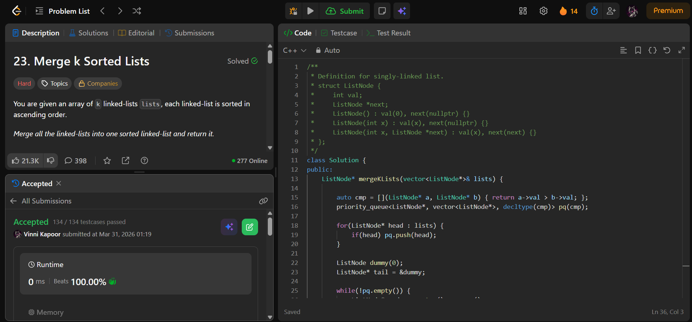

## Problem

**Merge k Sorted Lists (LeetCode 23)**

You are given an array of `k` linked lists, each sorted in ascending order.

Merge all the linked lists into one sorted linked list and return it.

---

## Approach

Use a **Min Heap (Priority Queue)** to efficiently merge all lists.

### Logic:

* Create a min heap that stores nodes based on their values
* Push the head of each non-empty list into the heap
* While heap is not empty:
  - Extract the smallest node
  - Attach it to the result list
  - If the extracted node has a next node → push it into heap

---

## Complexity

* **Time Complexity:** O(N log k)  
* **Space Complexity:** O(k)  

Where:
- `N` = total number of nodes  
- `k` = number of linked lists  

---

## Solution

```cpp
class Solution {
public:
    ListNode* mergeKLists(vector<ListNode*>& lists) {
        
        auto cmp = [](ListNode* a, ListNode* b) { return a->val > b->val; };
        priority_queue<ListNode*, vector<ListNode*>, decltype(cmp)> pq(cmp);

        for(ListNode* head : lists) {
            if(head) pq.push(head);
        }
        
        ListNode dummy(0);
        ListNode* tail = &dummy;
        
        while(!pq.empty()) {
            ListNode* node = pq.top(); pq.pop();
            tail->next = node;
            tail = tail->next;
            
            if(node->next) pq.push(node->next);
        }

        return dummy.next;

    }
};
```

---

## Proof of Submission



---