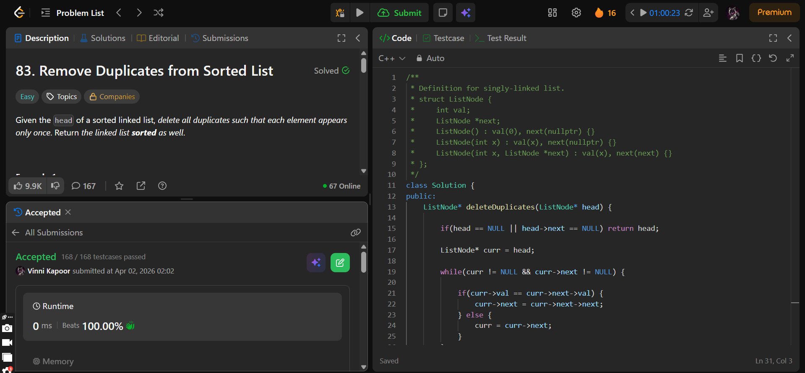

## Problem

**Remove Duplicates from Sorted List (LeetCode 83)**

Given the head of a sorted linked list, delete all duplicates such that each element appears only once.

Return the linked list in sorted order.

---

## Approach

Use **in-place traversal** to remove duplicates.

### Logic:

* Traverse the list using a pointer `curr`
* If current node value equals next node value:
  - Skip the next node by updating pointer
* Otherwise:
  - Move to next node
* Continue until end of list

---

## Complexity

* **Time Complexity:** O(n)  
* **Space Complexity:** O(1)  

---

## Solution

```cpp
class Solution {
public:
    ListNode* deleteDuplicates(ListNode* head) {

        if(head == NULL || head->next == NULL) return head;

        ListNode* curr = head;

        while(curr != NULL && curr->next != NULL) {

            if(curr->val == curr->next->val) {
                curr->next = curr->next->next;
            } else {
                curr = curr->next;
            }
        }

        return head;
        
    }
};
```

---

## Proof of Submission



---