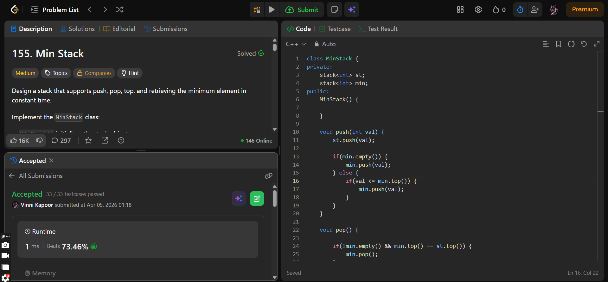

## Problem

**Valid Parentheses (LeetCode 20)**

Given a string `s` containing just the characters `'('`, `')'`, `'{'`, `'}'`, `'['` and `']'`, determine if the input string is valid.

A string is valid if:

* Open brackets are closed by the same type  
* Open brackets are closed in the correct order  
* Every closing bracket has a matching opening bracket  

---

## Approach

Use a **stack** to track opening brackets.

### Logic:

* If first character is a closing bracket → return false
* If length is odd → return false
* Traverse the string:
  - Push opening brackets onto stack
  - For closing brackets:
    * Check top of stack
    * If matching → pop
    * Else → return false
* At end:
  - If stack is empty → valid
  - Else → invalid

---

## Complexity

* **Time Complexity:** O(n)  
* **Space Complexity:** O(n)  

---

## Solution

```cpp
class Solution {
public:
    bool isValid(string s) {

        if(s[0] == '}' || s[0] == ')' || s[0] == ']') return false;
        if(s.length() % 2 != 0) return false;
        
        
        stack<int> st;

        for(char c : s) {

            if(c == '(' || c == '{' || c == '[') {
                st.push(c);
            } else {
                if(!st.empty()) {
                    char curr = st.top();
                    if((curr == '{' && c == '}') || (curr == '(' && c == ')') || (curr == '[' && c == ']')) {
                        st.pop();
                    } else {
                        return false;
                    }
                } else {
                    return false;
                }
            }
        }

        if(!st.empty()) return false;

        return true;
    }
};
```

---

## Proof of Submission



---