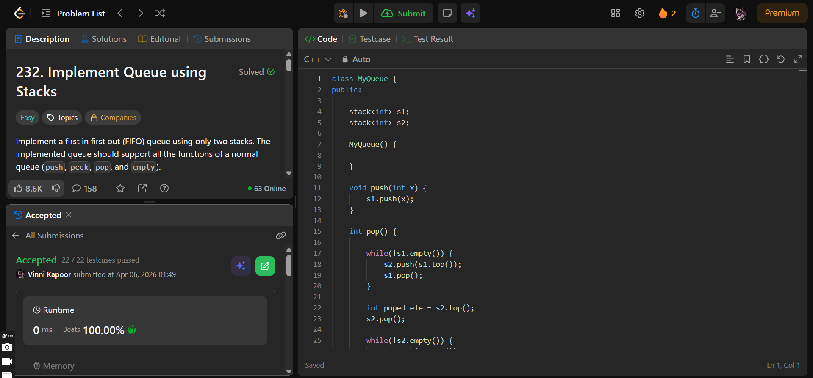

## Problem  

**Implement Queue using Stacks (LeetCode 232)**  

Implement a first in first out (FIFO) queue using only two stacks. The queue should support:

- `push(x)` → add element to back  
- `pop()` → remove front element  
- `peek()` → get front element  
- `empty()` → check if queue is empty  

---

## Approach  

Use **two stacks (`s1`, `s2`)** to simulate queue behavior.

### Logic:

- **push(x):**
  - Push element into `s1`  

- **pop():**
  - Move all elements from `s1 → s2`  
  - Pop top of `s2` (this is front of queue)  
  - Move elements back `s2 → s1`  

- **peek():**
  - Move all elements from `s1 → s2`  
  - Return top of `s2`  
  - Move elements back `s2 → s1`  

- **empty():**
  - Return `true` if `s1` is empty, else `false`  

---

## Complexity  

- **Time Complexity:**  
  - `push`: O(1)  
  - `pop`: O(n)  
  - `peek`: O(n)  
  - `empty`: O(1)  

- **Space Complexity:** O(n)  

---

## Solution  

```cpp
class MyQueue {
public:

    stack<int> s1;
    stack<int> s2;
    
    MyQueue() {
        
    }
    
    void push(int x) {
        s1.push(x);
    }
    
    int pop() {

        while(!s1.empty()) {
            s2.push(s1.top());
            s1.pop();
        }

        int poped_ele = s2.top();
        s2.pop();

        while(!s2.empty()) {
            s1.push(s2.top());
            s2.pop();
        }

        return poped_ele;
        
    }
    
    int peek() {

        while(!s1.empty()) {
            s2.push(s1.top());
            s1.pop();
        }

        int top_ele = s2.top();

        while(!s2.empty()) {
            s1.push(s2.top());
            s2.pop();
        }

        return top_ele;
        
    }
    
    bool empty() {
        if(s1.empty()) return true;

        return false;
    }
};
```

---

## Proof of Submission



---