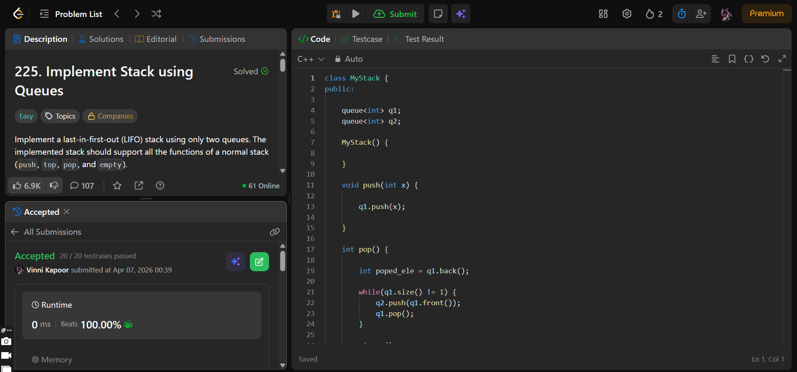

## Problem  

**Implement Stack using Queues (LeetCode 225)**  

Implement a last-in-first-out (LIFO) stack using only queues. The stack should support:

- `push(x)` → push element to top  
- `pop()` → remove and return top element  
- `top()` → return top element  
- `empty()` → check if stack is empty  

---

## Approach  

Use **two queues (`q1`, `q2`)** to simulate stack behavior.

### Logic:

- **push(x):**
  - Push element into `q1`  

- **pop():**
  - Store last element using `q1.back()`  
  - Move first `n-1` elements from `q1 → q2`  
  - Remove last element from `q1`  
  - Move elements back `q2 → q1`  
  - Return stored element  

- **top():**
  - Return `q1.back()` (represents stack top)  

- **empty():**
  - Return `true` if `q1` is empty, else `false`  

---

## Complexity  

- **Time Complexity:**  
  - `push`: O(1)  
  - `pop`: O(n)  
  - `top`: O(1)  
  - `empty`: O(1)  

- **Space Complexity:** O(n)  

---

## Solution  

```cpp
class MyStack {
public:

    queue<int> q1;
    queue<int> q2;

    MyStack() {
        
    }
    
    void push(int x) {

        q1.push(x);
        
    }
    
    int pop() {

        int poped_ele = q1.back();
        
        while(q1.size() != 1) {
            q2.push(q1.front());
            q1.pop();
        }

        q1.pop();

        while(!q2.empty()) {
            q1.push(q2.front());
            q2.pop();
        }

        return poped_ele;

    }
    
    int top() {
        
        return q1.back();
    }
    
    bool empty() {

        if(q1.empty()) return true;

        return false;
        
    }
};
```

---

## Proof of Submission



---