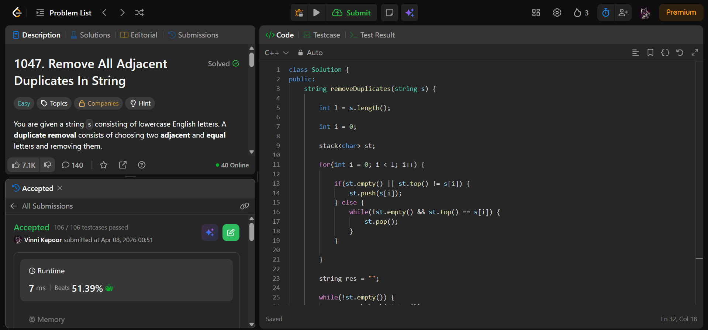

## Problem  

**Remove All Adjacent Duplicates In String (LeetCode 1047)**  

Given a string `s` consisting of lowercase English letters:

- Repeatedly remove **adjacent duplicate pairs**  
- Continue until no more removals can be made  

Return the final string.  
(It is guaranteed the answer is unique.)

---

## Approach  

Use a **stack** to simulate removal of adjacent duplicates.

### Logic:

- Traverse the string:
  - If stack is empty OR top ≠ current character → push  
  - Else:
    - Remove all matching adjacent duplicates by popping  

- Build result:
  - Pop all characters from stack  
  - Reverse to get correct order  

---

## Complexity  

- **Time Complexity:** O(n)  
  - Each character is pushed and popped at most once  

- **Space Complexity:** O(n)  

---

## Solution  

```cpp
class Solution {
public:
    string removeDuplicates(string s) {
        
        int l = s.length();

        int i = 0;

        stack<char> st;

        for(int i = 0; i < l; i++) {

            if(st.empty() || st.top() != s[i]) {
                st.push(s[i]);
            } else {
                while(!st.empty() && st.top() == s[i]) {
                    st.pop();
                }
            }
            
        }

        string res = "";

        while(!st.empty()) {
            res.push_back(st.top());
            st.pop();
        }

        reverse(res.begin(), res.end());

        return res;
    }
};
```

---

## Proof of Submission



---