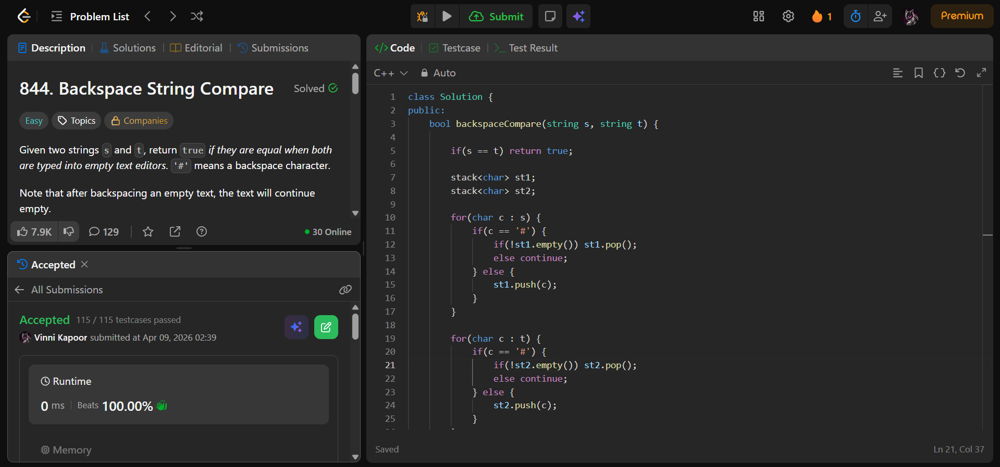

## Problem  

**Backspace String Compare (LeetCode 844)**  

Given two strings `s` and `t`, return `true` if they are equal after processing backspaces:

- `'#'` represents a backspace character  
- Backspacing an empty string results in an empty string  

---

## Approach  

Use **two stacks** to simulate typing with backspaces.

### Logic:

- Process string `s`:
  - If character is not `#` → push into stack  
  - If `#` → pop if stack not empty  

- Process string `t` using same logic  

- Compare resulting stacks:
  - If sizes differ → return false  
  - Otherwise compare element by element  

---

## Complexity  

- **Time Complexity:** O(n + m)  
- **Space Complexity:** O(n + m)  

---

## Solution  

```cpp
class Solution {
public:
    bool backspaceCompare(string s, string t) {

        if(s == t) return true;
    
        stack<char> st1;
        stack<char> st2;

        for(char c : s) {
            if(c == '#') {
                if(!st1.empty()) st1.pop();
                else continue;
            } else {
                st1.push(c);
            }
        }

        for(char c : t) {
            if(c == '#') {
                if(!st2.empty()) st2.pop();
                else continue;
            } else {
                st2.push(c);
            }
        }

        if(st1.size() != st2.size()) return false;

        while(!st1.empty() && !st2.empty()) {
            if(st1.top() != st2.top()) {
                return false;
            } else {
                st1.pop();
                st2.pop();
            }
        }

        return st1.size() == st2.size();

    }
};
```

---

## Proof of Submission



---