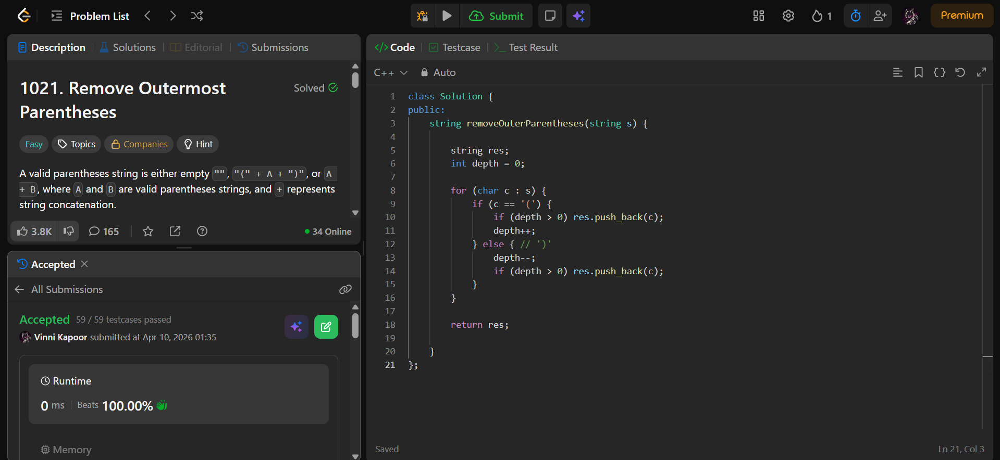

## Problem  

**Remove Outermost Parentheses (LeetCode 1021)**  

A valid parentheses string can be decomposed into **primitive components**.

- A primitive string cannot be split into two non-empty valid parts  
- Given a valid string `s = P1 + P2 + ... + Pk`  
- Remove the **outermost parentheses** of each primitive  

Return the final string.

---

## Approach  

Use a **depth counter (greedy)** to track nesting level.

### Logic:

- Initialize `depth = 0` and empty result string  

- Traverse string:
  - If `'('`:
    - If `depth > 0` → add to result  
    - Increase depth  

  - If `')'`:
    - Decrease depth  
    - If `depth > 0` → add to result  

- This ensures:
  - Outermost parentheses (depth 0 → 1 and 1 → 0 transitions) are skipped  

---

## Complexity  

- **Time Complexity:** O(n)  
- **Space Complexity:** O(n)  

---

## Solution  

```cpp
class Solution {
public:
    string removeOuterParentheses(string s) {
        
        string res;
        int depth = 0;

        for (char c : s) {
            if (c == '(') {
                if (depth > 0) res.push_back(c);
                depth++;
            } else { // ')'
                depth--;
                if (depth > 0) res.push_back(c);
            }
        }

        return res;

    }
};
```

---

## Proof of Submission



---