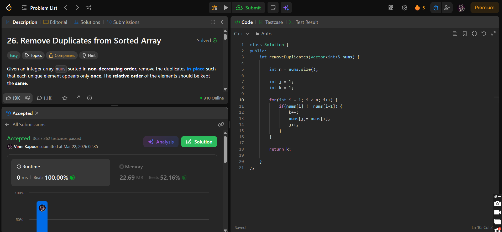

## Problem

**Remove Duplicates from Sorted Array (LeetCode 26)**

Given a sorted array `nums`, remove duplicates in-place such that each unique element appears only once.
Return the number of unique elements `k`, and ensure the first `k` elements contain the final result in sorted order.

---

## Approach

Since the array is already **sorted**, duplicates will always be adjacent.

* Use **two pointers**:

  * `i` → traverses the array
  * `j` → keeps track of position for unique elements

### Logic:

* Start from index `1`
* Compare `nums[i]` with `nums[i-1]`
* If different:

  * Place it at `nums[j]`
  * Increment `j` and count `k`

---

## Complexity

* **Time Complexity:** O(n)
* **Space Complexity:** O(1) (in-place)

---

## Solution

```cpp
class Solution {
public:
    int removeDuplicates(vector<int>& nums) {

        int n = nums.size();

        int j = 1;
        int k = 1;

        for(int i = 1; i < n; i++) {
            if(nums[i] != nums[i-1]) {
                k++;
                nums[j] = nums[i];
                j++;
            }
        }

        return k;
    }
};
```

---

## Proof of Submission



---

