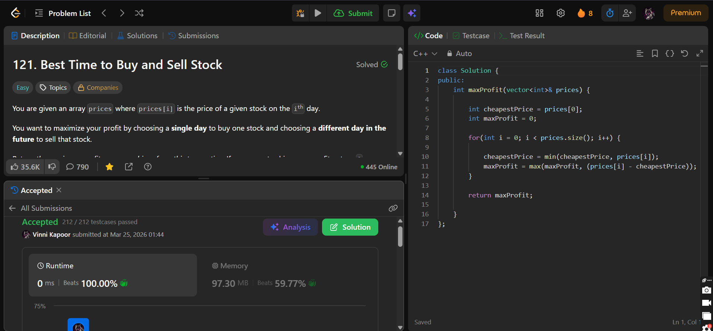

## Problem

**Best Time to Buy and Sell Stock (LeetCode 121)**

You are given an array `prices` where `prices[i]` is the price of a given stock on the ith day.

You want to maximize your profit by choosing a single day to buy one stock and choosing a different day in the future to sell that stock.

Return the maximum profit you can achieve. If no profit is possible, return `0`.

---

## Approach

Use a **greedy approach** by tracking the minimum price seen so far.

### Logic:

* Initialize:
  * `cheapestPrice` → first element
  * `maxProfit` → 0

* Traverse the array:
  * Update the minimum price seen so far
  * Calculate profit if sold today:
    
    `profit = prices[i] - cheapestPrice`

  * Update `maxProfit` accordingly

---

## Complexity

* **Time Complexity:** O(n)  
* **Space Complexity:** O(1)  

---

## Solution

```cpp
class Solution {
public:
    int maxProfit(vector<int>& prices) {

        int cheapestPrice = prices[0];
        int maxProfit = 0;

        for(int i = 0; i < prices.size(); i++) {
            
            cheapestPrice = min(cheapestPrice, prices[i]);
            maxProfit = max(maxProfit, (prices[i] - cheapestPrice));
        }

        return maxProfit;
        
    }
};

```

---

## Proof of Submission



---