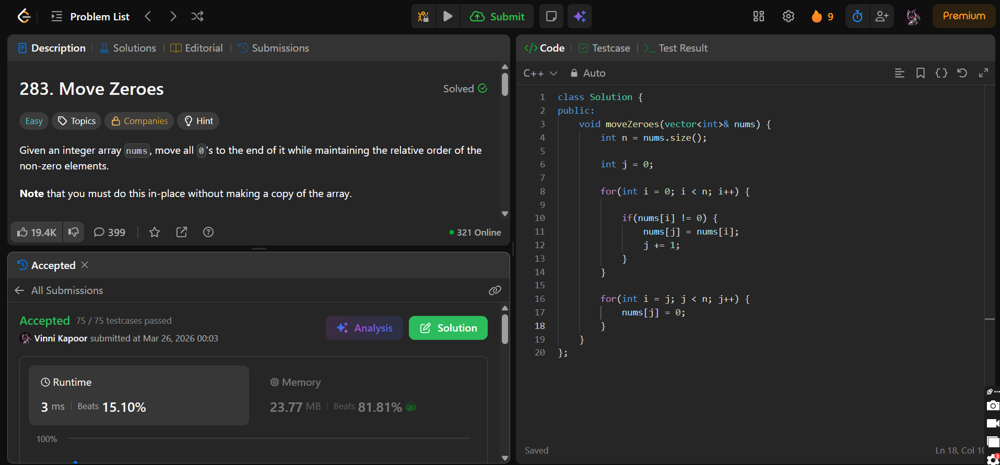

## Problem

**Move Zeroes (LeetCode 283)**

Given an integer array `nums`, move all `0`s to the end while maintaining the relative order of the non-zero elements.

You must do this **in-place** without making a copy of the array.

---

## Approach

Use a **two-pointer technique** to shift non-zero elements forward.

### Logic:

* Initialize pointer `j = 0` → position to place next non-zero
* Traverse array:
  - If `nums[i] != 0`:
    - Place it at `nums[j]`
    - Increment `j`

* After traversal:
  - Fill remaining positions from `j` to end with `0`

---

## Complexity

* **Time Complexity:** O(n)  
* **Space Complexity:** O(1)  

---

## Solution

```cpp
class Solution {
public:
    void moveZeroes(vector<int>& nums) {
        int n = nums.size();

        int j = 0;

        for(int i = 0; i < n; i++) {

            if(nums[i] != 0) {
                nums[j] = nums[i];
                j += 1;
            }
        }

        for(int i = j; j < n; j++) {
            nums[j] = 0;
        }
    }
};
```

---

## Proof of Submission



---