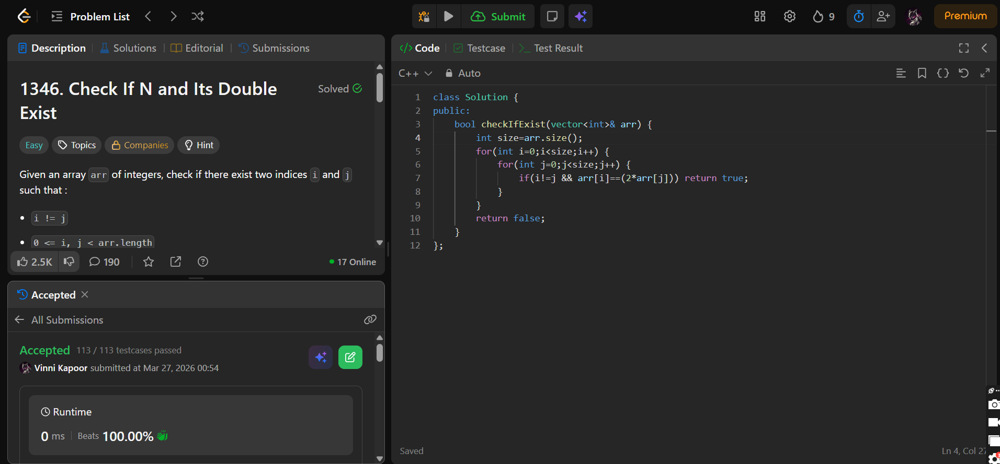

## Problem

**Check If N and Its Double Exist (LeetCode 1346)**

Given an array `arr` of integers, check if there exist two indices `i` and `j` such that:

- `i != j`
- `0 <= i, j < arr.length`
- `arr[i] == 2 * arr[j]`

Return `true` if such a pair exists, otherwise return `false`.

---

## Approach

Use **Brute Force (Two Loops)** to check all pairs.

### Logic:

* Iterate through all pairs `(i, j)`
* Ensure `i != j`
* Check if:
  
  `arr[i] == 2 * arr[j]`

* If found → return `true`
* If no such pair exists → return `false`

---

## Complexity

* **Time Complexity:** O(n²)  
* **Space Complexity:** O(1)  

---

## Solution

```cpp
class Solution {
public:
    bool checkIfExist(vector<int>& arr) {
        int size = arr.size();
        for(int i = 0; i < size; i++) {
            for(int j = 0; j < size; j++) {
                if(i != j && arr[i] == (2 * arr[j])) return true;
            }
        }
        return false;
    }
};
```

---

## Proof of Submission



---