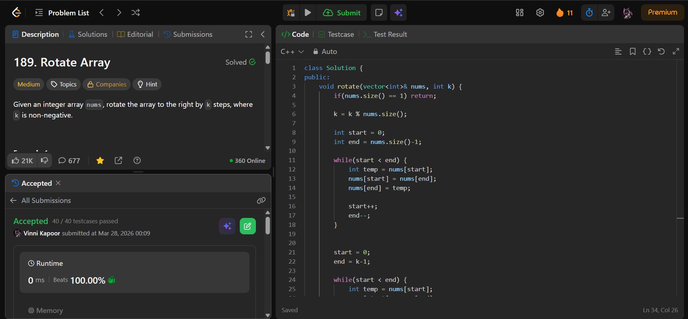

## Problem

**Rotate Array (LeetCode 189)**

Given an integer array `nums`, rotate the array to the right by `k` steps, where `k` is non-negative.

---

## Approach

Use the **Reversal Algorithm** to rotate the array in-place.

### Logic:

1. Normalize `k`:
   - `k = k % n` (to handle large rotations)

2. Reverse the entire array

3. Reverse first `k` elements

4. Reverse remaining `n-k` elements

This results in the rotated array.

---

## Complexity

* **Time Complexity:** O(n)  
* **Space Complexity:** O(1)  

---

## Solution

```cpp
class Solution {
public:
    void rotate(vector<int>& nums, int k) {
        if(nums.size() == 1) return;
        
        k = k % nums.size();
        
        int start = 0;
        int end = nums.size()-1;

        // reverse entire array
        while(start < end) {
            int temp = nums[start];
            nums[start] = nums[end];
            nums[end] = temp;

            start++;
            end--;
        }
            
        // reverse first k elements
        start = 0;
        end = k - 1;

        while(start < end) {
            int temp = nums[start];
            nums[start] = nums[end];
            nums[end] = temp;

            start++;
            end--;
        }

        // reverse remaining elements
        start = k;
        end = nums.size() - 1;

        while(start < end) {
            int temp = nums[start];
            nums[start] = nums[end];
            nums[end] = temp;

            start++;
            end--;
        }
    }
};
```

---

## Proof of Submission



---