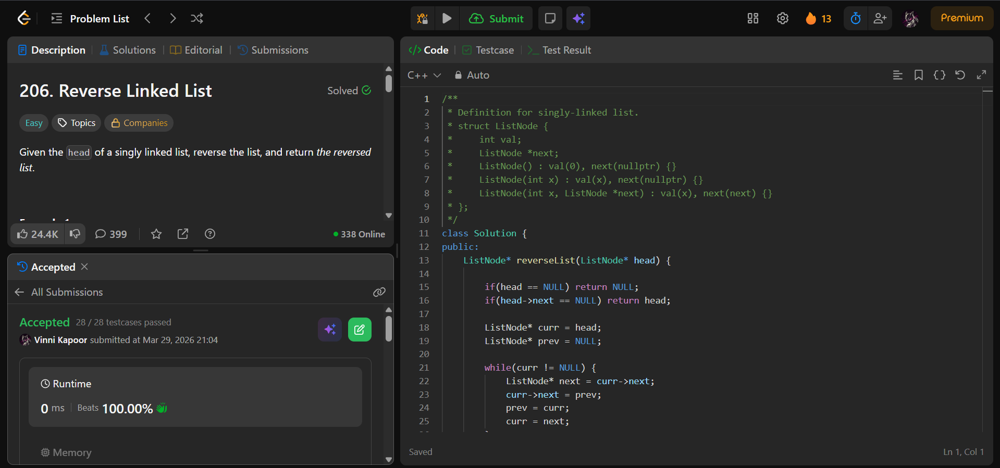

## Problem

**Reverse Linked List (LeetCode 206)**

Given the head of a singly linked list, reverse the list and return the reversed list.

---

## Approach

Use **iterative pointer reversal**.

### Logic:

* Maintain three pointers:
  - `prev` → previous node (initially `NULL`)
  - `curr` → current node (start from head)
  - `next` → store next node temporarily

* Traverse the list:
  - Store `next = curr->next`
  - Reverse link → `curr->next = prev`
  - Move pointers forward:
    - `prev = curr`
    - `curr = next`

* At the end, `prev` becomes the new head

---

## Complexity

* **Time Complexity:** O(n)  
* **Space Complexity:** O(1)  

---

## Solution

```cpp
class Solution {
public:
    ListNode* reverseList(ListNode* head) {

        if(head == NULL) return NULL;
        if(head->next == NULL) return head;

        ListNode* curr = head;
        ListNode* prev = NULL;

        while(curr != NULL) {
            ListNode* next = curr->next;  
            curr->next = prev;
            prev = curr;
            curr = next;  
        }

        return prev;
    }
};
```

---

## Proof of Submission



---