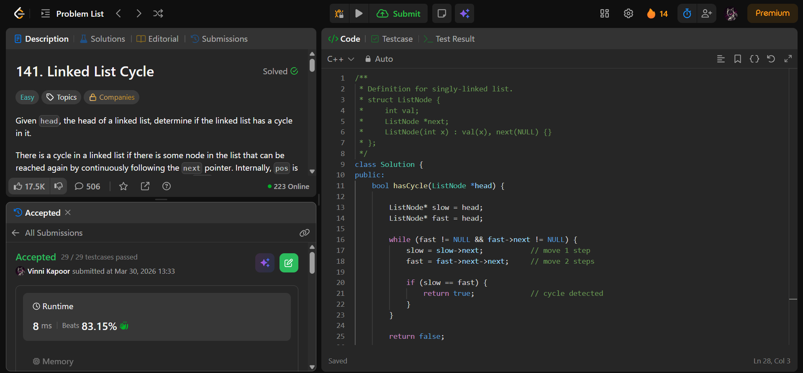

## Problem

**Linked List Cycle (LeetCode 141)**

Given the head of a linked list, determine if the linked list has a cycle.

A cycle exists if some node can be revisited by continuously following the `next` pointer.

Return `true` if there is a cycle, otherwise `false`.

---

## Approach

Use **Floyd’s Cycle Detection Algorithm (Two Pointers)**.

### Logic:

* Initialize two pointers:
  - `slow` → moves 1 step
  - `fast` → moves 2 steps

* Traverse the list:
  - If there is no cycle → `fast` reaches `NULL`
  - If there is a cycle → `slow` and `fast` will meet

---

## Complexity

* **Time Complexity:** O(n)  
* **Space Complexity:** O(1)  

---

## Solution

```cpp
class Solution {
public:
    bool hasCycle(ListNode *head) {

        ListNode* slow = head;
        ListNode* fast = head;

        while (fast != NULL && fast->next != NULL) {
            slow = slow->next;           // move 1 step
            fast = fast->next->next;     // move 2 steps

            if (slow == fast) {
                return true;             // cycle detected
            }
        }

        return false;

    }
};
```

---

## Proof of Submission



---