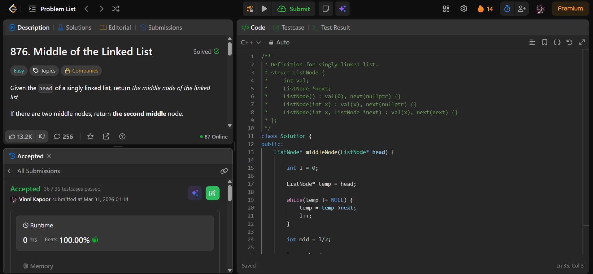

## Problem

**Middle of the Linked List (LeetCode 876)**

Given the head of a singly linked list, return the middle node.

If there are two middle nodes, return the **second middle node**.

---

## Approach

Use a **two-pass approach**.

### Logic:

1. Traverse the list to calculate its length `l`
2. Compute middle index:
   - `mid = l / 2`
3. Traverse again to reach the `mid` node
4. Return that node

---

## Complexity

* **Time Complexity:** O(n)  
* **Space Complexity:** O(1)  

---

## Solution

```cpp
class Solution {
public:
    ListNode* middleNode(ListNode* head) {
        
        int l = 0;

        ListNode* temp = head;

        while(temp != NULL) {
            temp = temp->next;
            l++;
        }

        int mid = l/2;

        temp = head;

        while(mid > 0) {
            temp = temp->next;
            mid--;
        }

        return temp;
    }
};
```

---

## Proof of Submission



---