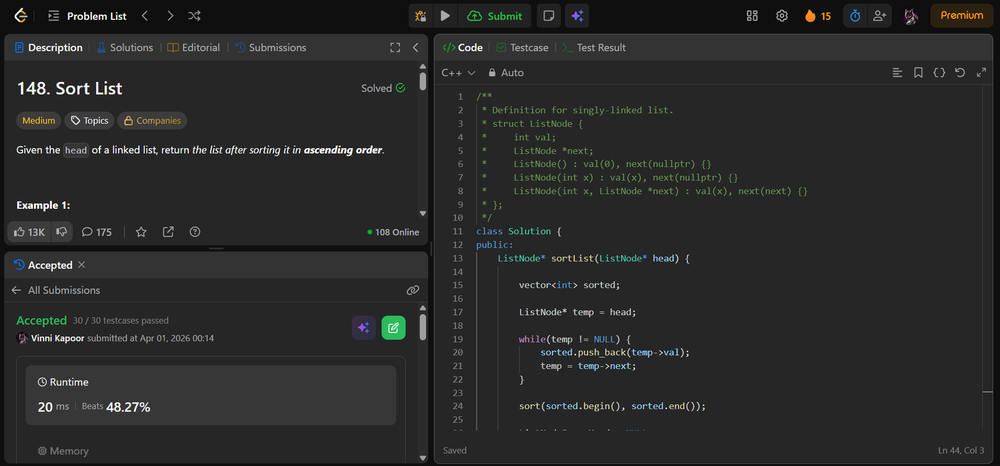

## Problem

**Sort List (LeetCode 148)**

Given the head of a linked list, return the list after sorting it in ascending order.

---

## Approach

Use **extra space with array conversion and sorting**.

### Logic:

* Traverse the linked list and store values in a vector
* Sort the vector
* Create a new linked list using sorted values
* Return the new list

---

## Complexity

* **Time Complexity:** O(n log n)  
* **Space Complexity:** O(n)  

---

## Solution

```cpp
class Solution {
public:
    ListNode* sortList(ListNode* head) {
        
        vector<int> sorted;

        ListNode* temp = head;

        while(temp != NULL) {
            sorted.push_back(temp->val);
            temp = temp->next;
        }

        sort(sorted.begin(), sorted.end());

        ListNode* newHead = NULL;
        ListNode* tail = NULL;

        for(int i = 0; i < sorted.size(); i++) {

            ListNode* node = new ListNode(sorted[i]);

            if(newHead == NULL) {
                newHead = node;
                tail = node;
            } else {
                tail->next = node;
                tail = node;
            }
        }

        return newHead;
    }
};
```

---

## Proof of Submission



---