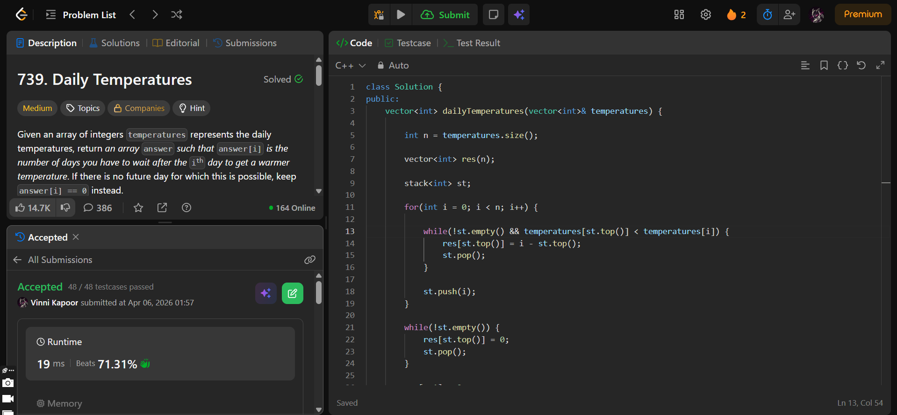

## Problem  

**Daily Temperatures (LeetCode 739)**  

Given an array `temperatures` representing daily temperatures, return an array `answer` such that:

- `answer[i]` is the number of days you have to wait after the `i-th` day to get a warmer temperature  
- If no such day exists → `answer[i] = 0`  

---

## Approach  

Use a **monotonic decreasing stack** to track indices of unresolved temperatures.

### Logic:

- Initialize:
  - Result array `res` of size `n`
  - Stack to store indices  

- Traverse array from left to right:
  - While stack is not empty **and current temperature is greater than temperature at stack top index**:
    - Calculate difference → `i - st.top()`
    - Store in result
    - Pop from stack  
  - Push current index into stack  

- After traversal:
  - Remaining indices in stack → no warmer day → assign `0`  

---

## Complexity  

- **Time Complexity:** O(n)  
  - Each element pushed and popped at most once  

- **Space Complexity:** O(n)  
  - Stack + result array  

---

## Solution  

```cpp
class Solution {
public:
    vector<int> dailyTemperatures(vector<int>& temperatures) {

        int n = temperatures.size();

        vector<int> res(n);
        
        stack<int> st;

        for(int i = 0; i < n; i++) {

            while(!st.empty() && temperatures[st.top()] < temperatures[i]) {
                res[st.top()] = i - st.top();
                st.pop();
            }

            st.push(i);
        }

        while(!st.empty()) {
            res[st.top()] = 0;
            st.pop();
        }

        res[n-1] = 0;

        return res;
        
    }
};
```

---

## Proof of Submission



---