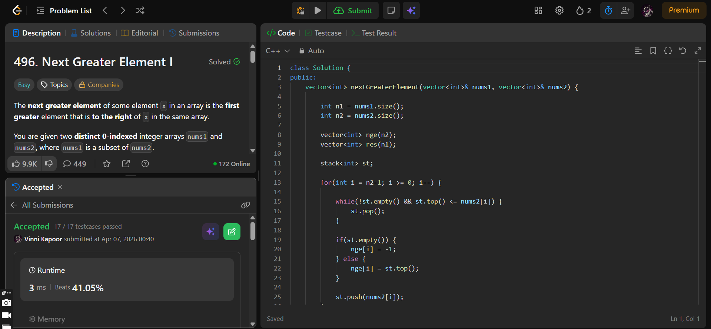

## Problem  

**Next Greater Element I (LeetCode 496)**  

The next greater element of an element `x` is the first greater element to its right in the same array.  

You are given two arrays:
- `nums1` (subset of `nums2`)
- `nums2` (all elements are distinct)

For each element in `nums1`, find its next greater element in `nums2`.  
If it does not exist → return `-1`.

---

## Approach  

Use a **monotonic decreasing stack** to precompute next greater elements for `nums2`.

### Logic:

- Traverse `nums2` from right to left:
  - Maintain a stack storing **greater candidates**
  - While stack top ≤ current element → pop
  - If stack is empty → no greater element → `-1`
  - Else → top of stack is next greater element  
  - Store result in `nge[]`
  - Push current element into stack  

- For each element in `nums1`:
  - Find its index in `nums2`
  - Use precomputed `nge[]` to get answer  

---

## Complexity  

- **Time Complexity:**  
  - NGE computation: O(n2)  
  - Searching indices: O(n1 × n2)  
  → Overall: **O(n1 × n2)**  

- **Space Complexity:** O(n2)  

---

## Solution  

```cpp
class Solution {
public:
    vector<int> nextGreaterElement(vector<int>& nums1, vector<int>& nums2) {

        int n1 = nums1.size();
        int n2 = nums2.size();

        vector<int> nge(n2);
        vector<int> res(n1);

        stack<int> st;

        for(int i = n2-1; i >= 0; i--) {

            while(!st.empty() && st.top() <= nums2[i]) {
                st.pop();
            }

            if(st.empty()) {
                nge[i] = -1;
            } else {
                nge[i] = st.top();
            }

            st.push(nums2[i]);
        }

        for(int i = 0; i < n1; i++) {
            auto it = find(nums2.begin(), nums2.end(), nums1[i]);
            int idx = it - nums2.begin();

            res[i] = nge[idx];
        }

        return res;
  
    }
};
```

---

## Proof of Submission



---