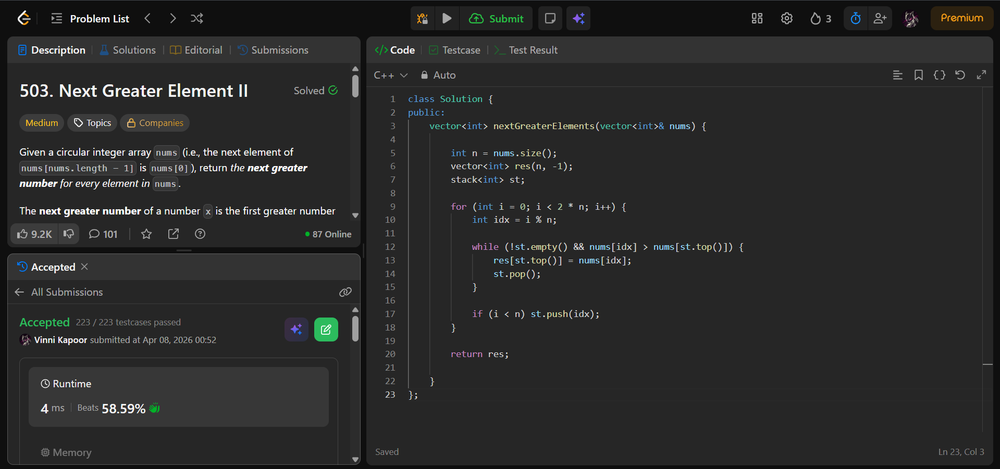

## Problem  

**Next Greater Element II (LeetCode 503)**  

Given a **circular array** `nums`, return an array `res` such that:

- `res[i]` is the **next greater element** of `nums[i]`  
- Search is circular (after last element, continue from beginning)  
- If no greater element exists → `-1`  

---

## Approach  

Use a **monotonic decreasing stack** with circular traversal.

### Logic:

- Initialize:
  - Result array `res` with `-1`  
  - Stack to store indices  

- Traverse array **twice (0 → 2n-1)**:
  - Use `i % n` to simulate circular behavior  
  - While:
    - Stack not empty  
    - Current element > element at index on top of stack  
    → Update result and pop  

  - Push index only during first pass (`i < n`)  

- Remaining elements → no greater element → stay `-1`  

---

## Complexity  

- **Time Complexity:** O(n)  
  - Each index pushed and popped at most once  

- **Space Complexity:** O(n)  

---

## Solution  

```cpp
class Solution {
public:
    vector<int> nextGreaterElements(vector<int>& nums) {
        
        int n = nums.size();
        vector<int> res(n, -1);
        stack<int> st;

        for (int i = 0; i < 2 * n; i++) {
            int idx = i % n;

            while (!st.empty() && nums[idx] > nums[st.top()]) {
                res[st.top()] = nums[idx];
                st.pop();
            }

            if (i < n) st.push(idx);
        }

        return res;

    }
};
```

---

## Proof of Submission



---