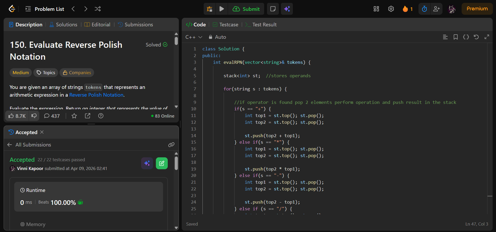

## Problem  

**Evaluate Reverse Polish Notation (LeetCode 150)**  

You are given an array of strings `tokens` representing an expression in **Reverse Polish Notation (postfix notation)**.

Evaluate the expression and return the final integer result.

### Rules:
- Valid operators: `+`, `-`, `*`, `/`
- Division truncates toward zero  
- Expression is always valid  

---

## Approach  

Use a **stack-based evaluation**.

### Logic:

- Traverse each token:
  - If token is a number → push into stack  
  - If token is an operator:
    - Pop top two elements (`top1`, `top2`)
    - Apply operation: `top2 op top1`
    - Push result back into stack  

- Final stack top → answer  

---

## Complexity  

- **Time Complexity:** O(n)  
- **Space Complexity:** O(n)  

---

## Solution  

```cpp
class Solution {
public:
    int evalRPN(vector<string>& tokens) {

        stack<int> st;  // stores operands

        for(string s : tokens) {

            // if operator is found pop 2 elements perform operation and push result in the stack
            if(s == "+") {
                int top1 = st.top(); st.pop();
                int top2 = st.top(); st.pop();

                st.push(top2 + top1);
            } else if(s == "*") {
                int top1 = st.top(); st.pop();
                int top2 = st.top(); st.pop();

                st.push(top2 * top1);
            } else if(s == "-") {
                int top1 = st.top(); st.pop();
                int top2 = st.top(); st.pop();

                st.push(top2 - top1);
            } else if (s == "/") {
                int top1 = st.top(); st.pop();
                int top2 = st.top(); st.pop();

                // division follows truncation toward zero
                st.push(top2 / top1);
            } else {
                // operand
                st.push(stoi(s));
            }
        }

        return st.top(); // value of expression
    }
};
```

---

## Proof of Submission



---