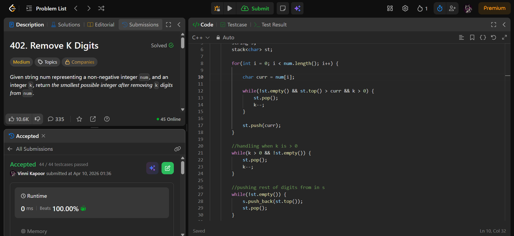

## Problem  

**Remove K Digits (LeetCode 402)**  

Given a string `num` representing a non-negative integer and an integer `k`, remove `k` digits such that the resulting number is the **smallest possible**.

Return the result as a string.

---

## Approach  

Use a **monotonic increasing stack (greedy)** to build the smallest number.

### Logic:

- Traverse each digit:
  - While:
    - Stack not empty  
    - Top digit > current digit  
    - `k > 0`  
    → Pop from stack (remove larger digits to minimize number)  

  - Push current digit into stack  

- If `k > 0` after traversal:
  - Remove remaining digits from top  

- Build result:
  - Pop all elements into string  
  - Remove leading zeros  
  - Reverse string  

- If result is empty → return `"0"`  

---

## Complexity  

- **Time Complexity:** O(n)  
- **Space Complexity:** O(n)  

---

## Solution  

```cpp
class Solution {
public:
    string removeKdigits(string num, int k) {
        
        string s;
        stack<char> st;

        for(int i = 0; i < num.length(); i++) {

            char curr = num[i];
            
            while(!st.empty() && st.top() > curr && k > 0) {
                st.pop();
                k--;
            }

            st.push(curr);
        }

        // handling when k > 0
        while(k > 0 && !st.empty()) {
            st.pop();
            k--;
        }

        // pushing remaining digits into string
        while(!st.empty()) {
            s.push_back(st.top());
            st.pop();
        }

        // removing leading zeros
        for(int i = s.length() - 1; i >= 0; i--) {
            if(s[i] == '0') s.pop_back();
            else break;
        }

        // reverse to get correct order
        reverse(s.begin(), s.end());

        if(s == "") return "0";

        return s;
    }
};
```

---

## Proof of Submission



---