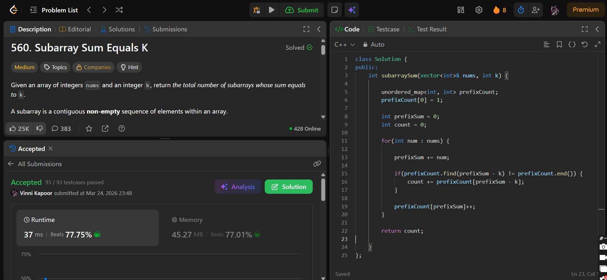

## Problem

**Subarray Sum Equals K (LeetCode 560)**

Given an array of integers `nums` and an integer `k`, return the total number of subarrays whose sum equals `k`.

A subarray is a contiguous non-empty sequence of elements within an array.

---

## Approach

Use **Prefix Sum + Hash Map** to efficiently count subarrays.

### Logic:

* Maintain a running `prefixSum`
* Use a map to store frequency of prefix sums

For each element:
- Add current number to `prefixSum`
- Check if `(prefixSum - k)` exists in map:
  - If yes → add its frequency to count
- Store/update current `prefixSum` in map

### Key Insight:
If:
Then subarray `(i+1 → j)` has sum `k`

---

## Complexity

* **Time Complexity:** O(n)  
* **Space Complexity:** O(n)  

---

## Solution

```cpp
class Solution {
public:
    int subarraySum(vector<int>& nums, int k) {

        unordered_map<int, int> prefixCount;
        prefixCount[0] = 1;

        int prefixSum = 0;
        int count = 0;

        for(int num : nums) {

            prefixSum += num;

            if(prefixCount.find(prefixSum - k) != prefixCount.end()) {
                count += prefixCount[prefixSum - k];
            }

            prefixCount[prefixSum]++;
        }

        return count;

    }
};
```

---

## Proof of Submission



---