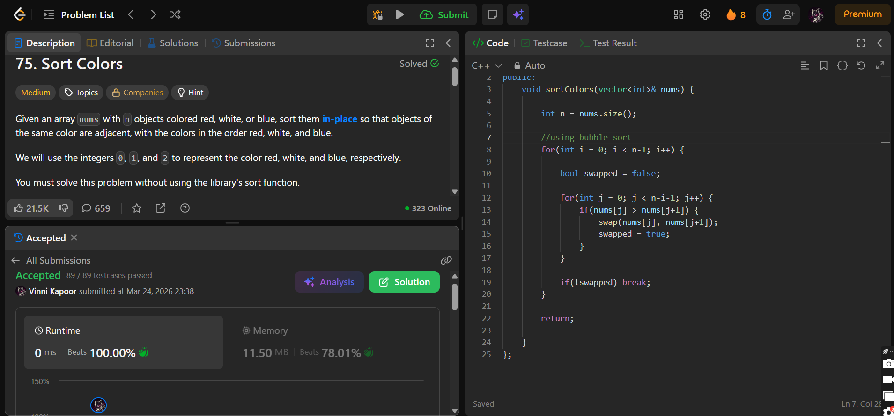

## Problem

**Sort Colors (LeetCode 75)**

Given an array `nums` with `n` objects colored red, white, or blue, sort them in-place so that objects of the same color are adjacent, with the colors in the order red, white, and blue.

We use integers:
- `0` → red  
- `1` → white  
- `2` → blue  

You must solve this problem **without using the library sort function**.

---

## Approach

Used **Bubble Sort** to sort the array in-place.

### Logic:

* Traverse the array multiple times
* In each pass:
  * Compare adjacent elements
  * Swap if they are in the wrong order
* Use a `swapped` flag:
  * If no swaps occur → array already sorted → break early

---

## Complexity

* **Time Complexity:** O(n²)  
* **Space Complexity:** O(1)  

---

## Solution

```cpp
class Solution {
public:
    void sortColors(vector<int>& nums) {

        int n = nums.size();

        // using bubble sort
        for(int i = 0; i < n-1; i++) {

            bool swapped = false;

            for(int j = 0; j < n-i-1; j++) {
                if(nums[j] > nums[j+1]) {
                    swap(nums[j], nums[j+1]);
                    swapped = true;
                }
            }

            if(!swapped) break;
        }

        return;
        
    }
};

```

---

## Proof of Submission



---