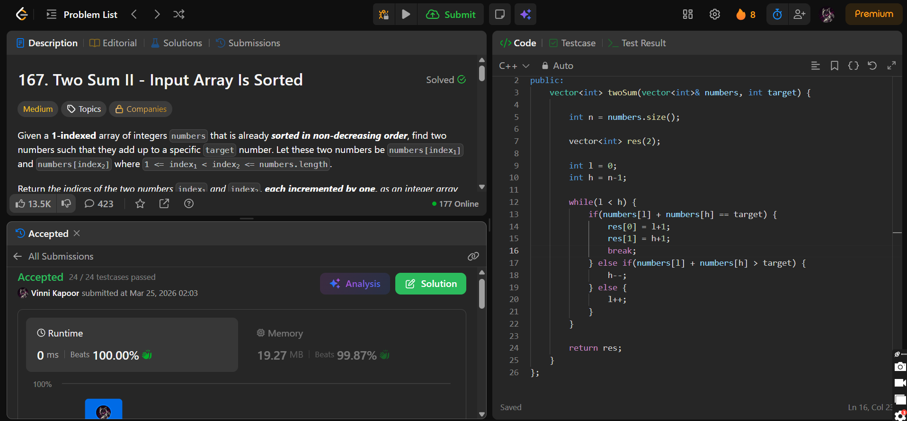

## Problem

**Two Sum II - Input Array Is Sorted (LeetCode 167)**

Given a 1-indexed array of integers `numbers` that is sorted in non-decreasing order, find two numbers such that they add up to a specific `target`.

Return the indices of the two numbers (`index1`, `index2`) such that:

- `1 <= index1 < index2 <= numbers.length`
- The answer should be returned as `[index1, index2]`
- Each index is **1-based**

It is guaranteed that exactly one solution exists.

You must use only **constant extra space**.

---

## Approach

Use the **Two Pointer technique** since the array is sorted.

### Logic:

* Initialize:
  - `l = 0` (start)
  - `h = n - 1` (end)

* While `l < h`:
  - If `numbers[l] + numbers[h] == target` → return indices
  - If sum > target → move `h--`
  - If sum < target → move `l++`

---

## Complexity

* **Time Complexity:** O(n)  
* **Space Complexity:** O(1)  

---

## Solution

```cpp
class Solution {
public:
    vector<int> twoSum(vector<int>& numbers, int target) {

        int n = numbers.size();

        vector<int> res(2);

        int l = 0;
        int h = n - 1;

        while(l < h) {
            if(numbers[l] + numbers[h] == target) {
                res[0] = l + 1;
                res[1] = h + 1;
                break;
            } else if(numbers[l] + numbers[h] > target) {
                h--;
            } else {
                l++;
            }
        }

        return res;
    }
};
```

---

## Proof of Submission



---