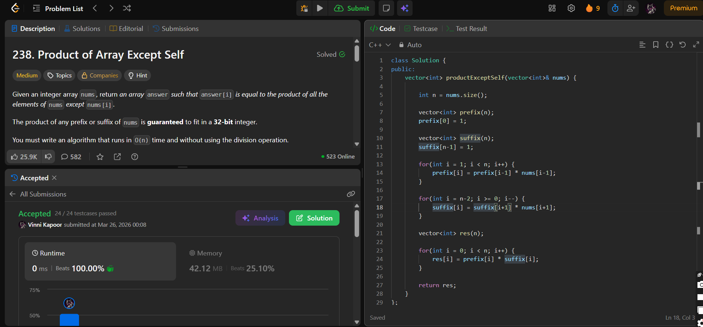

## Problem

**Product of Array Except Self (LeetCode 238)**

Given an integer array `nums`, return an array `answer` such that  
`answer[i]` is equal to the product of all the elements of `nums` except `nums[i]`.

Constraints:
- Must run in **O(n)** time  
- Cannot use the **division operator**

---

## Approach

Use **Prefix and Suffix products**.

### Logic:

* Create two arrays:
  - `prefix[i]` → product of all elements before `i`
  - `suffix[i]` → product of all elements after `i`

* Build prefix array:
  - `prefix[i] = prefix[i-1] * nums[i-1]`

* Build suffix array:
  - `suffix[i] = suffix[i+1] * nums[i+1]`

* Final result:
  - `res[i] = prefix[i] * suffix[i]`

---

## Complexity

* **Time Complexity:** O(n)  
* **Space Complexity:** O(n)  

---

## Solution

```cpp
class Solution {
public:
    vector<int> productExceptSelf(vector<int>& nums) {

        int n = nums.size();

        vector<int> prefix(n);
        prefix[0] = 1;

        vector<int> suffix(n);
        suffix[n-1] = 1;

        for(int i = 1; i < n; i++) {
            prefix[i] = prefix[i-1] * nums[i-1];
        }

        for(int i = n-2; i >= 0; i--) {
            suffix[i] = suffix[i+1] * nums[i+1];
        }
        
        vector<int> res(n);

        for(int i = 0; i < n; i++) {
            res[i] = prefix[i] * suffix[i];
        }

        return res;
    }
};
```

---

## Proof of Submission



---