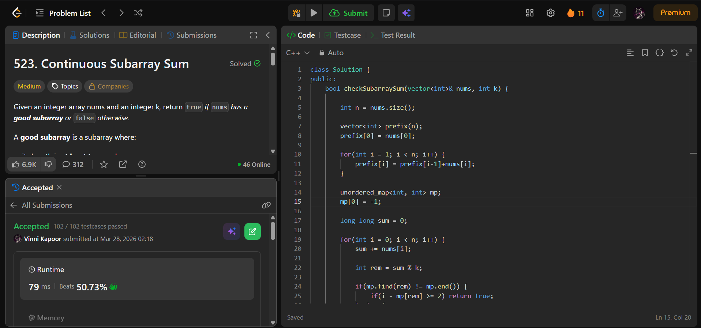

## Problem

**Continuous Subarray Sum (LeetCode 523)**

Given an integer array `nums` and an integer `k`, return `true` if the array has a continuous subarray of size at least 2 whose sum is a multiple of `k`.

A subarray is a contiguous part of the array.

---

## Approach

Use **Prefix Sum + Hash Map (modulo technique)**.

### Logic:

* Maintain a running `sum`
* Compute remainder:
  
  `rem = sum % k`

* Store first occurrence of each remainder in a map

### Key Observation:

If:

```prefixSum[j] % k == prefixSum[i] % k```

Then:

```(prefixSum[j] - prefixSum[i]) % k == 0```


Subarray `(i+1 → j)` has sum multiple of `k`

### Condition:
- Subarray length ≥ 2 → `j - i >= 2`

---

## Complexity

* **Time Complexity:** O(n)  
* **Space Complexity:** O(n)  

---

## Solution

```cpp
class Solution {
public:
    bool checkSubarraySum(vector<int>& nums, int k) {

        int n = nums.size();

        unordered_map<int, int> mp;
        mp[0] = -1;

        long long sum = 0;

        for(int i = 0; i < n; i++) {
            sum += nums[i];

            int rem = sum % k;

            if(mp.find(rem) != mp.end()) {
                if(i - mp[rem] >= 2) return true;
            } else {
                mp[rem] = i;
            }
        }

        return false;
    }
};
```

---

## Proof of Submission



---