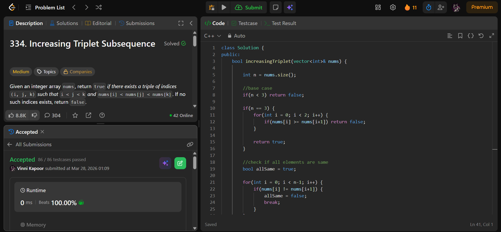

## Problem

**Increasing Triplet Subsequence (LeetCode 334)**

Given an integer array `nums`, return `true` if there exists a triplet `(i, j, k)` such that:

- `i < j < k`
- `nums[i] < nums[j] < nums[k]`

Otherwise, return `false`.

---

## Approach

Use a **greedy approach** to track the smallest and second smallest elements.

### Logic:

* Maintain two variables:
  - `firstEle` → smallest value seen so far  
  - `secondEle` → second smallest value  

* Traverse the array:
  - If `nums[i] <= firstEle` → update `firstEle`
  - Else if `nums[i] <= secondEle` → update `secondEle`
  - Else → found a third element greater than both → return `true`

---

## Complexity

* **Time Complexity:** O(n)  
* **Space Complexity:** O(1)  

---

## Solution

```cpp
class Solution {
public:
    bool increasingTriplet(vector<int>& nums) {

        int firstEle = INT_MAX;
        int secondEle = INT_MAX;

        for(int i = 0; i < nums.size(); i++) {
            if(nums[i] <= firstEle) {
                firstEle = nums[i];
            } else if(nums[i] <= secondEle) {
                secondEle = nums[i]; 
            } else {
                return true;
            }
        }

        return false;
    }
};
```

---

## Proof of Submission



---