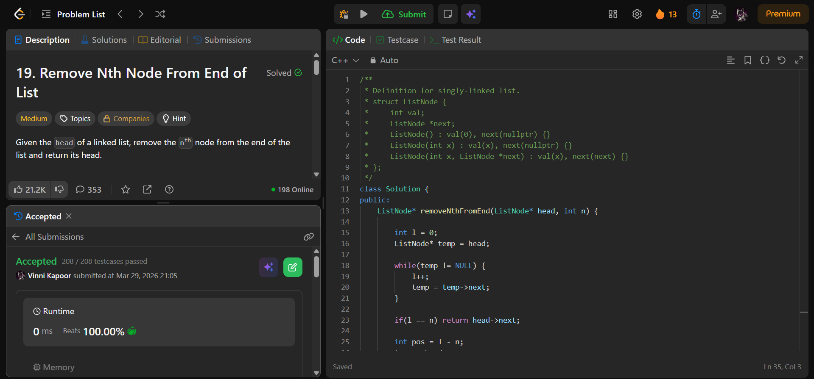

## Problem

**Remove Nth Node From End of List (LeetCode 19)**

Given the head of a linked list, remove the nth node from the end and return its head.

---

## Approach

Use a **two-pass approach**:

### Logic:

1. Traverse the list to find its length `l`
2. If `l == n`, remove the head node
3. Otherwise:
   - Find the `(l - n)`th node from the start
   - Remove its next node

---

## Complexity

* **Time Complexity:** O(n)  
* **Space Complexity:** O(1)  

---

## Solution

```cpp
class Solution {
public:
    ListNode* removeNthFromEnd(ListNode* head, int n) {
        
        int l = 0;
        ListNode* temp = head;

        while(temp != NULL) {
            l++;
            temp = temp->next;
        }

        if(l == n) return head->next;

        int pos = l - n;
        temp = head;
        for(int i = 1; i < pos; i++) {
            temp = temp->next;
        }

        temp->next = temp->next->next;

        return head;
    }
};
```

---

## Proof of Submission



---