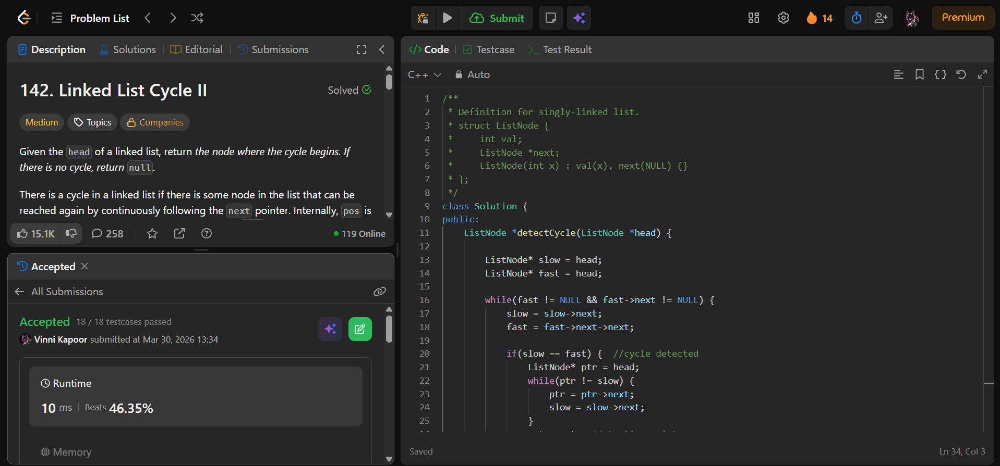

## Problem

**Linked List Cycle II (LeetCode 142)**

Given the head of a linked list, return the node where the cycle begins.  
If there is no cycle, return `NULL`.

You must not modify the linked list.

---

## Approach

Use **Floyd’s Cycle Detection Algorithm (Two Pointers)**.

### Logic:

1. **Detect Cycle**
   - Use `slow` (1 step) and `fast` (2 steps)
   - If they meet → cycle exists

2. **Find Start of Cycle**
   - Initialize a pointer `ptr` at head
   - Move both `ptr` and `slow` one step at a time
   - The point where they meet is the **start of the cycle**

---

## Complexity

* **Time Complexity:** O(n)  
* **Space Complexity:** O(1)  

---

## Solution

```cpp
class Solution {
public:
    ListNode *detectCycle(ListNode *head) {

        ListNode* slow = head;
        ListNode* fast = head;

        while(fast != NULL && fast->next != NULL) {
            slow = slow->next;
            fast = fast->next->next;

            if(slow == fast) {  // cycle detected
                ListNode* ptr = head;
                while(ptr != slow) { 
                    ptr = ptr->next;
                    slow = slow->next;
                }
                return ptr; // starting point of cycle
            }
        }

        return NULL; // no cycle
    }
};
```

---

## Proof of Submission



---